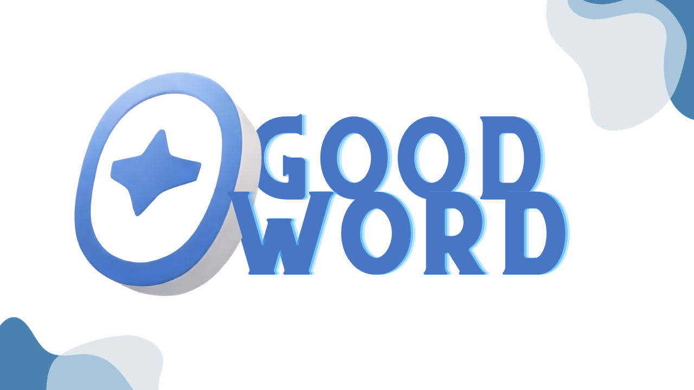

# GoodWord Chrome Extension



## Overview

GoodWord is a Chrome extension designed to enhance your online experience by replacing offensive language with asterisks (****). With a simple toggle, you can turn the extension on or off, giving you control over the content you encounter while browsing.

## Features

- **Profanity Filtering:** GoodWord automatically replaces offensive words with asterisks to create a more positive online environment.

- **Toggle On/Off:** Easily enable or disable the extension with a single click, allowing you to customize your browsing experience.

- **User Statistics:** Keep track of your online interactions with real-time statistics on the number of censored words found and replaced on the current webpage. Additionally, see the overall count of censored words across all webpages since the extension was installed. The extension also rates the explicitness of a webpage based on the number of swear words it contains.

## Installation

To install GoodWord, follow these simple steps:

1. Clone this repository to your local machine.
    ```bash
    git clone https://github.com/yourusername/goodword-chrome-extension.git
    ```

2. Open Google Chrome and navigate to `chrome://extensions/`.

3. Enable "Developer mode" in the top right corner of the Extensions page.

4. Click on "Load unpacked" and select the directory where you cloned the GoodWord extension.

5. The GoodWord extension icon will appear in your Chrome toolbar.

## Usage

1. Click on the GoodWord icon in the Chrome toolbar to toggle the extension on or off.

2. Enjoy a more positive online experience with GoodWord!

<!-- ## Contribution

We welcome contributions to improve and expand the functionality of GoodWord. If you would like to contribute, please follow these guidelines:

1. Fork the repository.

2. Create a new branch for your feature or bug fix.

3. Make your changes and submit a pull request.

4. Ensure your code passes linting and testing.

5. Your contribution will be reviewed, and once approved, it will be merged into the main branch. -->

## License

This project is licensed under the MIT License - see the [LICENSE](LICENSE) file for details.

## Acknowledgments

- Special thanks to the open-source community for their valuable contributions.

## Contact

If you have any questions or issues, feel free to contact us!

Happy browsing with GoodWord! 😇